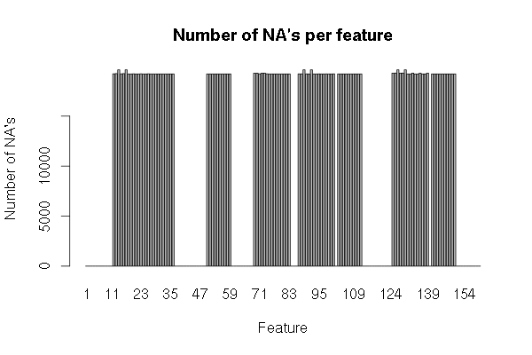

#1. Overview

This is the course project for the Practical Machine Learning course in the Data Science specialization track from Coursera.

In the context of devices capable of collecting training informaiton, the goal of the project is to predict the manner in which someone has done an exercice from the data acquired by the device.

#2. The Data

The training and test data are part of the Weight Lifting Exercise Dataset ([`http://groupware.les.inf.puc-rio.br/har`](http://groupware.les.inf.puc-rio.br/har)). The training set is composed of 19622 observations of  160 variables whereas the test dats has only 20 observations.

###2.1 Cleaning the Data

A quick look at the data shows a great deal of features showing no mesures at all.



I decided thus to clean the data to keep only the relevant features, which leaves only 59 features instead of the 159 present in the dataset. Furthermore, the first 6 features seamed to have user specific information such as unsername and timestamps, so I ignored them as well.

###2.2 Data Pre-Processing

The remaining features being all numeric with different ranges, I proceeded to center and scale the data as well as performing principal component analysis to reduce the number of variables and capture at least 95% of the variance (with 25 variables). This was particularly useful for training a Random Forest model as the complexity and time to train it grow very fast with the number of features.

```
prePro <- preProcess(trainingTrain[, -54], method = c("center", "scale", "pca"), thresh = 0.95)
```
Although centering and scaling is not particularly useful for trees, I wanted to compare the performance of different models, including linear models which might be more sensible to data-scale variation.

#3. Training the Models

###3.1 Training and Validation Data

In order to validate the training results I divided the training data in a training subset containg 70% of the data and a validation subset with the rest of it.

```
tr <- createDataPartition(training$classe, p = 0.7, list = FALSE)
trainingTrain <- training[tr, ]
trainingVal <- training[-tr, ]
```

###3.2 Cross-Validation

I used Caret's `trainControl` function to implement 7-fold cross-validation of the parameters.

```
ctrl <- trainControl(method = "cv", number = 7)
```

###3.3 The Models
####Logistic Regression
I started working on the project in week 2, before the lessons on regression and classification trees. I thus though that the problem needed to be tackled only by linear models, so I tryed logistic regression first.
```
ctrl2 <- trainControl(method = "cv", number = 7, repeats = 2)
model2 <- train(trainingTrain$classe ~ . , data = trainingTrainPP, trControl = ctrl2,
                method = "logreg")
```
The 7-fold cross validation resulted in a model yielding a 38% accuracy.
```
Ordered Logistic or Probit Regression 

19622 samples
   25 predictors
    5 classes: 'A', 'B', 'C', 'D', 'E' 

No pre-processing
Resampling: Cross-Validated (7 fold) 

Summary of sample sizes: 16819, 16819, 16818, 16818, 16819, 16819, ... 

Resampling results

  Accuracy   Kappa      Accuracy SD  Kappa SD   
  0.3847727  0.2039299  0.006621095  0.008260498
```

After predicting the class with this model, I used the `confusionMatrix` function to compare the results on the validation set.
```
#calculate predictions on trainingTest with model 2
trainingTestPP.predictions2 <- predict(model2, trainingTestPP)
confusionMatrix2 <- confusionMatrix(trainingTest$classe,
                                    trainingTestPP.predictions2)
```
\

A 25%, the overall accuracy is more than 10% lower than the cross-validation in the model, which seems a bit bizarre.
```
Confusion Matrix and Statistics

          Reference
Prediction   A   B   C   D   E
         A 763 141 100 223 447
         B 630 142  63  81 223
         C 395 108  86 104 333
         D 476 134  72 115 167
         E 438  96  71 101 376

Overall Statistics
                                          
               Accuracy : 0.2518          
                 95% CI : (0.2408, 0.2631)
    No Information Rate : 0.4591          
    P-Value [Acc > NIR] : 1               
                                          
                  Kappa : 0.0305          
 Mcnemar's Test P-Value : <2e-16    
```  

\  

####CART

I then used a classification tree model with 7-fold validation.
```
model6 <- train(trainingTrain$classe ~ . , data = trainingTrain[-54], 
                method = "rpart2", trControl = ctrl2)
```
```
CART 

13737 samples
   26 predictors
    5 classes: 'A', 'B', 'C', 'D', 'E' 

No pre-processing
Resampling: Cross-Validated (7 fold) 

Summary of sample sizes: 11774, 11776, 11775, 11774, 11774, 11775, ... 

Resampling results across tuning parameters:

  maxdepth  Accuracy   Kappa       Accuracy SD  Kappa SD   
  1         0.3393024  0.09496843  0.003211527  0.005499628
  2         0.3818149  0.17608682  0.003628003  0.004583588
  3         0.4265136  0.24952474  0.010062773  0.015997082

Accuracy was used to select the optimal model using  the largest value.
The final value used for the model was maxdepth = 3. 
```
\

This model shows 43% accuracy, which is pretty much identical to the one obtained on the validation set:
```
Confusion Matrix and Statistics

          Reference
Prediction    A    B    C    D    E
         A 1421   78    0   94   81
         B  561  305    0  118  155
         C  824   86    0   32   84
         D  361  101    0  296  206
         E  384   86    0  106  506

Overall Statistics
                                          
               Accuracy : 0.4296          
                 95% CI : (0.4169, 0.4423)
    No Information Rate : 0.6034          
    P-Value [Acc > NIR] : 1               
                                          
                  Kappa : 0.246           
 Mcnemar's Test P-Value : <2e-16          
```
\  

####Random Forest  
The default Random Forest method seems to do a great job with an accuracy of 98% (using bootstrapping)
```
ctrl1 <- trainControl(method = "boot632", number = 3)
model1 <- train(trainingTrain$classe ~ . , data = trainingTrainPP, trControl = ctrl1)
```
```
Random Forest 

13737 samples
   26 predictors
    5 classes: 'A', 'B', 'C', 'D', 'E' 

No pre-processing
Resampling: Bootstrapped (3 reps) 

Summary of sample sizes: 13737, 13737, 13737 

Resampling results across tuning parameters:

  mtry  Accuracy   Kappa      Accuracy SD  Kappa SD   
   2    0.9774285  0.9714728  0.001055554  0.001298913
  14    0.9729728  0.9658467  0.001374866  0.001694580
  27    0.9621458  0.9521632  0.002170334  0.002694379

Accuracy was used to select the optimal model using  the largest value.
The final value used for the model was mtry = 2.
```
\

This accuracy is confirmed on the validation set:
```
Confusion Matrix and Statistics

          Reference
Prediction    A    B    C    D    E
         A 1658    6    5    3    2
         B   24 1100   11    2    2
         C    0   17  996   13    0
         D    0    0   42  921    1
         E    0    5    0    0 1077

Overall Statistics
                                         
               Accuracy : 0.9774         
                 95% CI : (0.9733, 0.981)
    No Information Rate : 0.2858         
    P-Value [Acc > NIR] : < 2.2e-16      
                                         
                  Kappa : 0.9714         
 Mcnemar's Test P-Value : NA             
```
\  

#4. Conclusions and Predictions

The best fit for the data seems to come from the Random Forest model, with a 98% accuracy. This accuracy is consistent between the 7-fold validation on the training data (70% of the total) and subsequent testing on the remaining 30% of the data, so we can expect it to generalize outside of this sample, in particular to the 20 testing cases.


